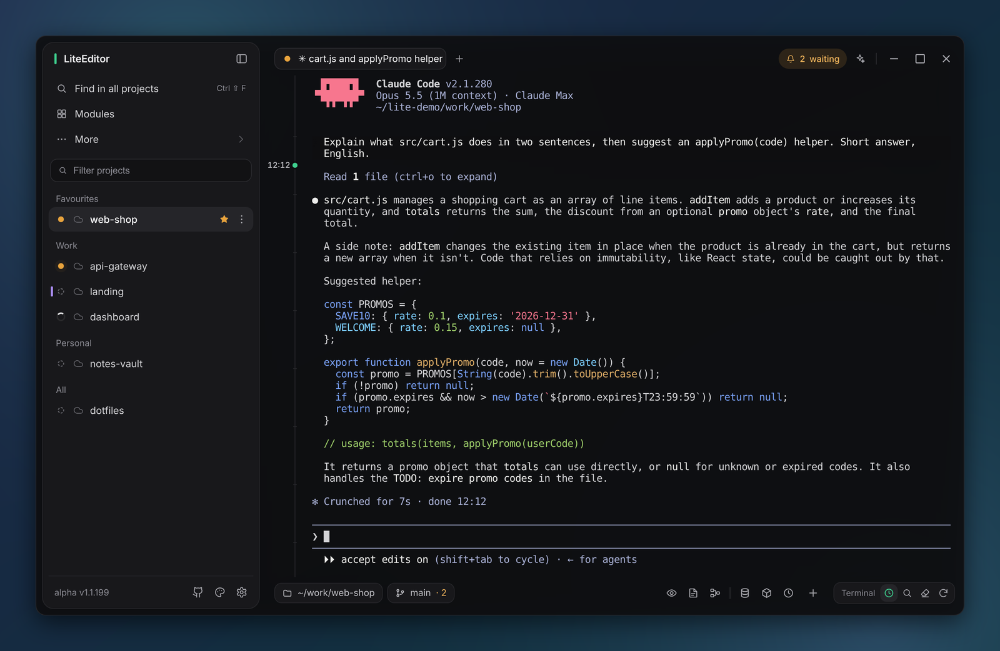
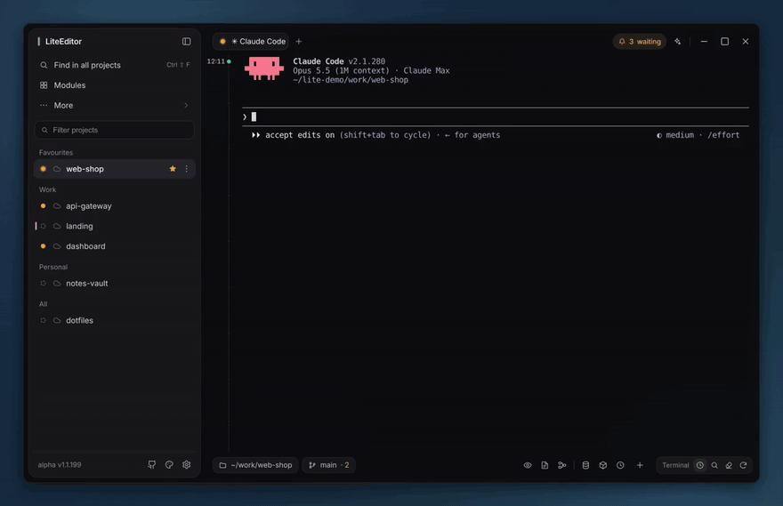
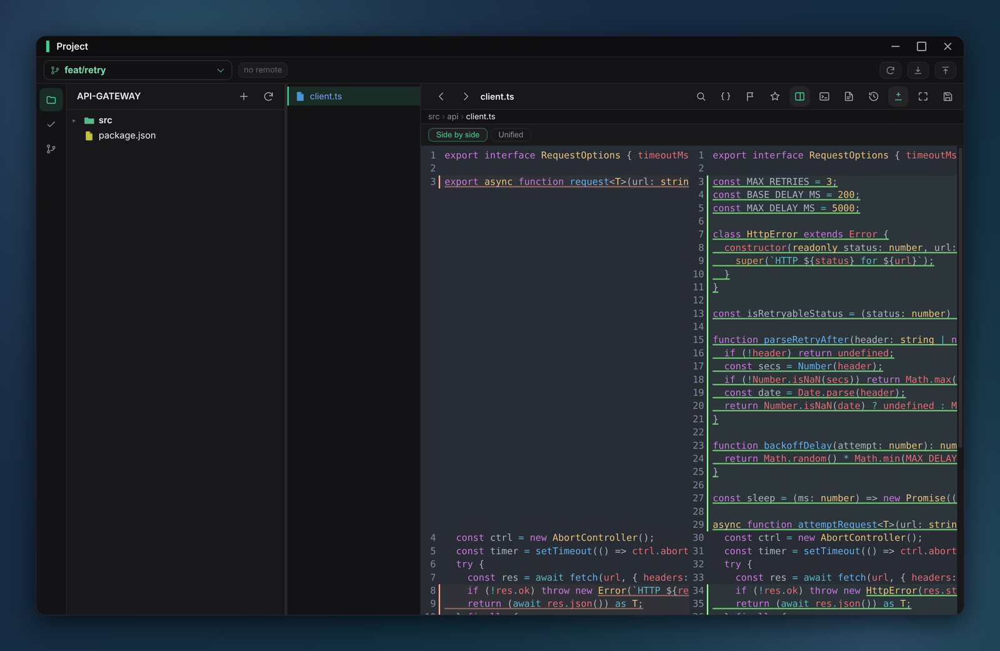
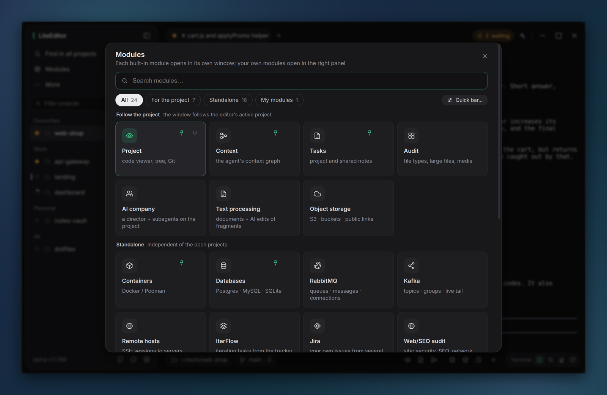
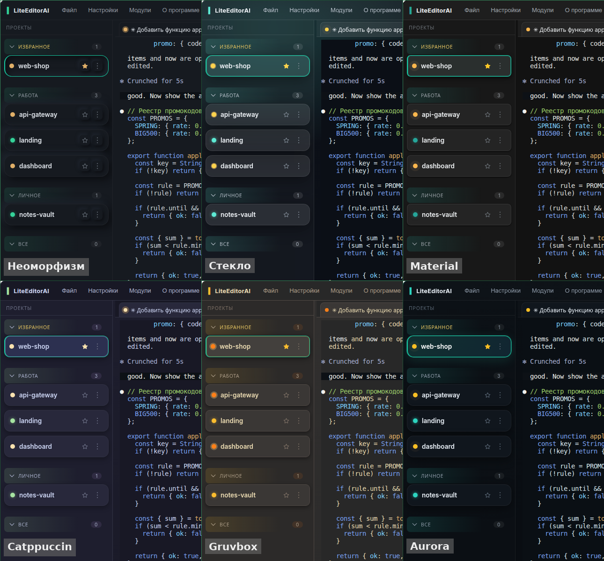

<div align="center">

# ▍ LiteEditorAI

### 代码由智能体来写，而你在这里盯着它们。

一个以终端为核心的桌面工作台，写给**指挥 AI 编程智能体**
（Claude Code、Codex、Gemini CLI、Qwen…）而不是自己敲每一行代码的开发者。

[](LICENSE)
[](https://github.com/DanielLetto2020/LiteEditorAI/releases)
[](#安装)
[](https://www.electronjs.org/)
[](#状态)

[English](README.md) · [Русский](README.ru.md) · **简体中文** · [lite-editor-ai.ru](https://lite-editor-ai.ru)

</div>



*三个项目里同时跑着三个智能体。标签页自动以智能体正在处理的任务命名；两个琥珀色圆点表示这两个
智能体在等你回答，标题栏里的徽标会把它们数出来。*

> [!NOTE]
> 界面语言可在**设置 → 界面语言**中切换：简体中文、English、Русский。语言文件是可插拔的
> `locales/<代码>.json`；中文翻译仍在完善中，尚未翻译的条目会以英文显示。欢迎提交改进。

## 为什么会有这个东西

传统编辑器是围绕「一个人敲代码」设计的。而今天这个人大部分时间在**阅读、引导和检查智能体**。
形态已经不合适了：

- 工作的中心不再是文件，而是**终端里的一段对话**。
- 完整的 IDE 为此过于笨重；而裸终端又是「瞎」的：哪个智能体干完了？哪个卡在等你回答？
  它刚刚改了你的哪些文件？
- 同时在三个项目里跑智能体，到中午你就已经跟不上了。

LiteEditorAI 把终端放在正中间，其他一切都只隔一个按键。打开文件夹就能开始干活 —
没有项目向导，也不用配置语言服务器。

## 有什么不一样

### 1. 一眼看清每个智能体



每个项目都有自己的**活的 shell 标签页** — 一个跑智能体，一个跑开发服务器，还有一个执行临时命令。
标签页会**用终端标题给自己命名**，对智能体来说这就是「它此刻正在做的任务」。

一个信号灯让你不必切换就知道状态：**工作中**（转圈）·**在等你回答**（琥珀色）·**已完成**（绿色）。
项目卡片汇总它下面所有标签页的状态，标题栏还带一个计数器 —— *有多少个智能体正卡在你身上*。
通知也是内置的。

上面的动图里还能看到命令面板（`Ctrl+K`）和模块目录。[完整视频](assets/screenshots/demo.mp4)。

### 2. 用手机盯着它们

**Android 遥控端**通过中继服务器把电脑上正在运行的终端画面镜像到平板或手机上，而且是**全彩**的，
所以智能体的 diff 依然是红绿分明的。它自带屏幕键盘，能**把手机剪贴板里的内容直接粘贴进电脑终端**，
可以切换项目、查看项目任务，也能浏览和下载电脑上的文件。

它只传输当前屏幕以及发生变化的部分（类似 mosh），而不是整个回滚缓冲区，所以重连几乎是瞬间完成，
在移动网络下也很舒服。你可以离开工位，坐在沙发上继续回答智能体，回来后还是同一个会话。

### 3. 看清智能体改了什么



**项目**窗口把代码查看器和 Git 并排放在一起，风格接近 PhpStorm：智能体改文件时**文件树自动刷新**，
支持所有语言的语法高亮、代码缩略图、自动补全、**blame** 标注、**与 HEAD 的并排 diff**、全项目替换、
**智能体模式**（代码上的作者归属层，右键「问智能体」），还有那道保险 ——
**带回滚的本地文件历史**，覆盖智能体在你提交之前所做的一切改动。

Git 就在同一个窗口里：用复选框选择性暂存、amend、commit / push / pull / fetch、stash、
单文件历史、cherry-pick / revert、三栏冲突解决、分支管理。

### 4. 把智能体的上下文当成图来搭

**上下文**模块把 `CLAUDE.md` / `AGENTS.md` **当作节点图**来构建（风格类似 n8n）：文本区块、
可整组开关的配置档、token 计数、恢复点。Claude 和 Codex 各自独立配置。
它还能帮你把现有的 `CLAUDE.md` 拆成区块，并从你过去与 Claude Code 的对话里挖掘出规则。

## 安装

预编译的安装包在 [**Releases**](https://github.com/DanielLetto2020/LiteEditorAI/releases) 页面。

| 系统 | 怎么装 |
|---|---|
| **Ubuntu / Debian**（x64） | `sudo apt install ./LiteEditorAI_*.deb` |
| **Windows**（x64） | 下载 `LiteEditorAI_*-win.zip`，解压到任意目录，运行 `LiteEditorAI.exe`。无需安装。程序未签名，SmartScreen 可能提示：*更多信息 → 仍要运行*。 |
| **macOS**（arm64 / x64） | 下载对应的 `.dmg`（Apple 芯片选 `-arm64`，Intel 选 `-x64`），把应用拖进「应用程序」。这是未经 Apple 签名的 ad-hoc 构建，首次启动时：*系统设置 → 隐私与安全性 → 仍要打开*（或执行 `xattr -dr com.apple.quarantine /Applications/LiteEditorAI.app`）。 |
| **从源码运行** | `npm install && npm start`（需要 Node.js 22+） |

## 还有 20 多个工具模块，让你不必离开工作台



**模块**是编辑器旁边的一个独立窗口。可以同时打开多个 —— 每个窗口都记住自己的大小和位置，
下次启动时会一并恢复。绑定项目的模块会跟随当前项目。

<details>
<summary><b>内置模块完整列表</b>（点击展开）</summary>

| 模块 | 做什么 |
|---|---|
| 👁 **项目**（查看器 + Git） | 代码与 Git 同处一窗 —— 见[上文](#3-看清智能体改了什么)。另有 Markdown / 图片 / HTML 预览、全项目替换（`Ctrl+Shift+R`，支持正则与 `$1` 分组）、历史搜索、收藏分支、文件树内的 Git 状态。 |
| 🧠 **上下文** | 把 `CLAUDE.md` / `AGENTS.md` 当图来搭 —— 见[上文](#4-把智能体的上下文当成图来搭)。 |
| ✅ **任务** | 带状态与优先级的 TODO，列表**和看板**（拖动改状态）、搜索、带进度的子任务清单、Markdown 预览、项目/共享两个标签页、把任务直接发进终端、JSON 导入导出。另有**日历**标签页：截止日期、**系统提醒**、月视图 —— 以及一个内置的 **MCP 服务器**（`lite-tasks`），让终端里的智能体自己读写提醒。 |
| 🔍 **审计** | 项目快速透视：文件类型、按行数/体积排出的最大文件（带异常标记）、按体积排列的媒体、卫生状况（git 里的垃圾、重复文件、压缩产物、孤立文件）、技术债（TODO/FIXME 与可疑密钥 —— 点击直达代码行）、历史（按 git churn 排出的热点文件、长期未动的文件）。可导出报告。 |
| 🤖 **AI 公司** | 一支在同一项目上工作的智能体团队：**总监**智能体拆解目标、「招聘」专员（编码、评审、测试…）并维护一块共享任务板；实时日志、角色库、只做计划的**演练模式**、预算上限、目标队列、带成本的运行历史。 |
| 🌐 **网站/SEO 审计** | 独立的站点分析器（本地开发服务器**或**公网域名）：安全响应头评分、TLS 证书、暴露的 `.git`/`.env`、从**渲染后**页面提取的 SEO 元信息（无头 Chromium）、Core Web Vitals 与页面体积、截图、技术栈、死链、robots/sitemap、DNS · SPF/DMARC · WHOIS · 地理位置。自带站点列表与带差异的审计历史。 |
| 🐳 **容器** | Docker **和** Podman 同处一个面板：按 compose 项目分组的容器（折叠分组时每个容器的状态以圆点显示在彩色标题里）、pod、镜像、卷、磁盘占用；单个或整组启动 / 停止 / 重启 / 删除；状态实时刷新、**实时日志**、**exec 终端**、容器内文件浏览器（文件可在查看器中打开）。能识别**数据库、RabbitMQ、Kafka、MinIO 和 Web 服务** —— **一键**在对应模块里打开并自动填好连接；带 Web 界面的容器还有「在浏览器中打开」按钮。也支持**远程主机**：通过 SSH 隧道连到宿主机的 docker/podman socket，权限不足时还能一键「用 SSH 修复」。 |
| 🗄 **数据库** | Postgres / MySQL · MariaDB / SQLite 客户端：直连或**通过 SSH 隧道**、连接标签页（同时打开多个库）、结构树、带分页的表数据与单元格级选择、**SQL 控制台**（`Ctrl+Enter`）、CSV / JSON / SQL 导出、只读模式。密码存放在系统钥匙串，驱动已内置。 |
| 🐰 **RabbitMQ** | 基于 management API 的 broker 客户端：带 **PRODUCTION** 保护的服务器配置、多 broker 标签页、带**实时图表**的总览（队列消息数、publish / deliver 速率）、带深度迷你图和「无消费者」标记的队列、**不消费即预览消息**、带路由校验的发布、以及 exchange 的**实时跟踪**（后台标签页里也照样跑）；purge / delete 需确认。 |
| 📨 **Kafka** | 基于 kafkajs 的集群客户端：带 PRODUCTION 保护的配置（SASL / TLS）、多集群标签页、吞吐与**消费组总延迟**实时图表、带 **ISR 健康度**的主题（创建 / 删除 / DeleteRecords / 分区 / retention / 配置）、**无痕预览消息**（临时消费组）、带 key 与 headers 的生产、**带延迟趋势的消费组**、偏移量重置、**实时跟踪**。 |
| 🔌 **远程主机** | 按分类管理的 **SSH / SFTP / FTP** 配置，一键登录、多个活动会话以标签页并存（密码或系统密钥、keepalive）、**SFTP/FTP 文件树**（按类型显示图标，展示权限 `rwxr-xr-x` 与八进制、属主与属组、大小和日期，并解析符号链接）；文件会在**带行号和语法高亮的代码编辑器**中打开，可用 `Ctrl+S` **直接保存回主机**，还支持复制和**下载**（含二进制文件）—— 也可以在查看器中编辑，每次保存同样会传回主机。**「服务」**按钮会扫描主机端口，并**通过 SSH 隧道**在各自模块里打开 Postgres / MySQL / RabbitMQ / Kafka —— 即使服务只监听主机的 localhost 也可以；Web 端口交给站点监控，docker/podman socket 交给容器模块。密码永不离开后端。 |
| ☁️ **对象存储** | S3 浏览器，内置 **11 家服务商预设**（AWS、MinIO、Cloudflare R2、Yandex、Backblaze B2、DO Spaces、Wasabi、GCS、Selectel、VK、Timeweb）：项目级与共享连接、存储桶与目录树、带排序/筛选/多选的对象表格（批量下载与删除）、**直接从桶里预览文件**、「在编辑器查看器中打开」、拖拽上传、带进度与取消的文件**及整个目录**下载（大文件走分片）、目录 / 重命名 / 复制 / 移动 / 删除。**隐私可控**：匿名模式访问他人的公开桶、单个对象的公开/私有一键切换、可选有效期的**预签名链接**。密钥存放在系统钥匙串；只读模式在后端强制生效。 |
| 🔑 **密码保险箱** | 用主密码解锁 KeePass `.kdbx` 数据库：搜索条目、复制密码 / 令牌 / 任意字段、**20 秒后自动清空剪贴板**。数据库 / RabbitMQ / Kafka / 远程主机 / 对象存储的连接表单里都有**「从保险箱」/「存入保险箱」**按钮。解密全程在本地完成 —— 主密码不会离开这台机器。 |
| 📡 **站点监控** | 每个 URL 可以挂任意多个检查项：可用性、按路径取 **JSON 字段**、页面上的文本、数值与阈值比较、「有变化」—— 或者**由智能体根据你的自然语言描述写出的自定义检查**（它能看到实时响应、可在对话中反复打磨、在沙箱中执行）。四种颜色状态并可通知，可看历史卡片或**月度图表**（可用率、平均延迟、有告警的天数）。**窗口关掉也继续检查**。 |
| 📋 **IterFlow** | 把 [IterFlow](https://iter-flow.ru) 跟踪器搬进编辑器：创建和编辑迭代与任务、截止日期、看板改状态、迭代阶段流转（提交 / 审批 / 验收）、项目笔记。对需要与客户确认范围的自由职业者和工作室很方便。 |
| ✍️ **文本处理** | Obsidian 风格的 AI 文档编辑器：项目文档树侧边栏、标签页、**富文本 ⇄ Markdown** 双模式、**KaTeX 公式**、格式工具条。选中一段文字要求改写 —— 由**无需 API 密钥的本地智能体**处理（Claude Code / Codex / Gemini），回答实时流式返回；智能体角色来自项目的 `Roles/*.md`，并带自动保存。 |
| 💬 **OpenRouter 聊天** | 用你自己的密钥：任意模型（附价格与上下文长度）、**流式**回答带 Markdown 与代码高亮、每个密钥多个会话、图片、密钥余额。密钥只留在本地。 |
| 🍅 **番茄钟** | 为「智能体自己在干活」的工作台准备的工作/休息计时器：休息时会有一层半透明遮罩盖住终端 —— 输入被锁住，**智能体继续运行**，输出依然可见。经典 25/5、52/17、超昼夜 90/20 或自定义方案，习惯统计带连续天数，标题栏有迷你计时器。倒计时在后台运行。 |
| 📈 **资源监视器** | 编辑器吃掉多少内存和 CPU —— 按进程（窗口、GPU、内核）**以及按终端里的智能体**（PTY 进程树）分别显示，带内存迷你图，可把摘要复制到剪贴板。 |
| 🖳 **系统终端** | 项目之外的独立 shell（家目录），支持多标签页，用来跑一次性的系统命令。 |
| 🔧 **开发工具** | 一把离线瑞士军刀：**Base64 ↔ 图片**（拖入文件即可）、**JSON 查看器**、Base64 / URL / Hex / HTML 实体、**JSON ↔ YAML**、query ↔ JSON、CSV ↔ JSON、JSONPath、哈希（MD5 / SHA-1/256/512）、**JWT 解码**、Unix **时间戳**与 **cron**（带解释和下次运行时间）、**行拼接**（被终端换行撕碎的文本重新拼回段落，保留列表、表格和代码）、大小写 / 转写、字符串操作、正则测试、文本差异、Lorem 与假数据生成、颜色转换。 |

</details>

**🧩 自己写模块。** *模块 → 创建模块…* 会生成一个插件骨架，并**在它的目录里打开一个终端**，
**你自己的 AI 智能体**就在那里按随附的规范写代码（`GUIDE.md` 和提示词会一起放在旁边）。
写好的模块出现在「我的模块」下，可热重载。作者规范见 [`module-kit/`](module-kit/)。

## 主题

六套主题 —— 新拟态（默认）、玻璃、Material、Catppuccin、Gruvbox、Aurora。终端会跟着界面一起换色。



## Android 遥控端

1. 从 [Releases](https://github.com/DanielLetto2020/LiteEditorAI/releases) 下载 `liteeditor-pult-*.apk`
   并安装到 Android 上（需允许安装未知来源应用）。
2. 在电脑上：菜单 **「遥控端」** → 注册账号（用户名/密码）。
3. 在设备上用同一个账号登录。
4. 菜单 → **「连接此设备」** → 在电脑上批准（核对验证码）。完成。

编辑器里版本号旁边有一个徽标，显示已连接设备的数量；点击可以看到设备列表，
对每台设备都能查询系统信息与位置，或者**断开**它（不删除 —— 一键就能恢复访问）。

只知道密码是不够的：设备必须**在电脑上被批准**。内置了防暴力破解、可撤销会话，
以及一个「在所有设备退出」按钮。

> 中继服务器**能看到流量**（不是端到端加密）—— 涉及私有代码时请把这一点考虑进去。
> 遥控端处于 **alpha** 阶段。

## 快捷键

| 按键 | 作用 |
|---|---|
| `Ctrl+Shift+T` / `Ctrl+Shift+W` | 新建 / 关闭终端标签页 |
| `Ctrl+PageUp` / `Ctrl+PageDown` | 切换终端标签页 |
| `Ctrl+Enter` | 在终端里换行（继续输入，不执行） |
| `Ctrl+C` / `Ctrl+V` | 复制选中内容 / 粘贴（任意键盘布局都可用） |
| `Ctrl+\` | 单终端模式 |
| `Ctrl+K` | 命令面板 |
| `Ctrl+F` / `Ctrl+Shift+F` | 在终端或文件中搜索 / 搜索所有已打开的终端 |
| `Ctrl+S` | 保存文件 |
| `Ctrl+Shift+R` | 全项目替换（项目窗口内） |
| `Ctrl+1..9` / `Ctrl+Tab` | 切换项目 |
| `Ctrl + +/−` · `F11` | 字号 · 全屏 |

## 状态

**Alpha**，在积极开发中。项目可以开任意多个终端标签页，标签页的**名字**能在重启后保留
（进程本身不能）。查看器一次打开一个文件，跳过大于 2 MB 的文件。它是一个「能编辑的查看器」，
不是要替代你 IDE 的重构引擎 —— 这是刻意的取舍。

缺陷与想法请提到 [Issues](https://github.com/DanielLetto2020/LiteEditorAI/issues)。

## 从源码构建

```bash
npm install        # 依赖 + 为 Electron 重新编译 node-pty
npm start          # 打包前端并启动
```

需要 Node.js 22+（Linux / Windows x64；macOS 的安装包只能在 macOS 上构建）。
更多开发者信息见 [CONTRIBUTING.md](CONTRIBUTING.md)。

### Pull request

不需要仓库写权限 —— 通过 fork 参与。请 fork 本仓库，从 **`contrib`** 分支切出，
并把 PR 提到 **`contrib`**（不是 `main`）。被接受的改动会被合入开发线，
并在接下来的某个版本中发布；评审由维护者手动进行。详见 [CONTRIBUTING.md](CONTRIBUTING.md)。

**翻译也非常欢迎**：语言文件就是 [`locales/`](locales/) 里的 `<代码>.json`，
改一个文件就能让整个界面变成你的语言。

## 致谢

这个项目在很大程度上是靠社区长起来的 —— 感谢每一位帮过忙的人。

**Pull request**
- [@Ainour108](https://github.com/Ainour108) —— 重新设计「文本处理」模块：文档树侧边栏、标签页、智能体回答的实时流式显示、原生文件对话框（[#6](https://github.com/DanielLetto2020/LiteEditorAI/pull/6)）
- [@anupamme](https://github.com/anupamme) —— 中继服务器的 `/reports` 端点从查询串密钥改为 `Authorization` 头（[#9](https://github.com/DanielLetto2020/LiteEditorAI/pull/9)）

**缺陷报告**
- [@Eurgen](https://github.com/Eurgen) —— 状态栏里的 emoji（[#1](https://github.com/DanielLetto2020/LiteEditorAI/issues/1)）、发行包缺少文件导致的崩溃（[#5](https://github.com/DanielLetto2020/LiteEditorAI/issues/5)）

**想法与建议**
- [@Eurgen](https://github.com/Eurgen) —— 终端 shell 选择（[#2](https://github.com/DanielLetto2020/LiteEditorAI/issues/2)）、`Ctrl+Enter` 换行（[#4](https://github.com/DanielLetto2020/LiteEditorAI/issues/4)）以及其他建议（[#3](https://github.com/DanielLetto2020/LiteEditorAI/issues/3)）

## 许可

[Apache License 2.0](LICENSE) © 2026 Maksim Kuzminskiy。使用及衍生作品请保留署名（见 [NOTICE](NOTICE)）。

基于 [Electron](https://www.electronjs.org/)、[xterm.js](https://xtermjs.org/)、
[node-pty](https://github.com/microsoft/node-pty) 和 [CodeMirror 6](https://codemirror.net/) 构建。
